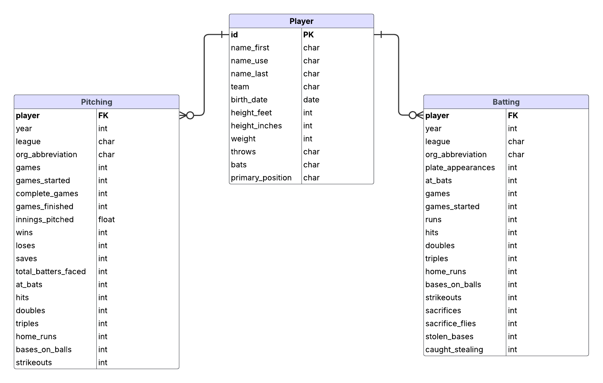

<!-- TABLE OF CONTENTS -->

  
Table of Contents

  <ol>
    <li>
      <a href="#about-the-project">About The Project</a>
      <ul>
        <li><a href="#omissions">Omissions</a></li>
        <li><a href="#built-with">Built With</a></li>
      </ul>
    </li>
    <li><a href="#installation">Installation</a></li>
    <li>
      <a href="#documentation">Documentation</a>
      <ul>
        <li><a href="#models">Models</a></li>
        <li><a href="#api">API</a></li>
      </ul>
    </li>
    <li><a href="#license">License</a></li>
    <li><a href="#contact">Contact</a></li>
  </ol>

<!-- ABOUT THE PROJECT -->
## About The Project
- This is a webapp whose primary frameworks are Django and Vue.
- The project is in a "developer" stage only. There is no distribution. It is currently meant to run using the Django development server as the backend service and the Vite development server as the web server for the frontend.
- The database is Django's default SQLite. Other options seemed out of scope.
- For the ETL, tools like Spark, dbt, Airflow etc, also all seemed out of scope. Therefore python **pandas** is used for the transformation and validation. This seemed a little more reasonable based on time constraints and project scope.
    - The need is small.
    - It allows the ETL process to be easily implemented as a custom Django admin command.
    - It allows me to demonstrate proficiency with pandas because it's always useful to have pandas in your back pocket :panda_face:
- The project is essentially made of 2 Vue.js components in a parent-child relationship. These are placed in a minimal page framework for purposes of the demo. In the future I'd like to integrate these components (and more) into a cool template like [this](https://demos.creative-tim.com/vue-black-dashboard/)
- Quick note: In my code I don't adhere strictly to 72 char lines. It's so short! I usually shoot for around 80ish. However I'm perfectly happy to adhere to any code standards, use formatters, prettifiers, etc.

(<a href="#readme-top">back to top</a>)

### Omissions

There are lots of things which could or should be included in a production level project, but they are not included here for a number of reasons: time constraint, out of scope, or potentially not implemented within the group/dept.
Examples:
- Unit testing
- Type hinting
- Responsive UI
- CSS framework

I am capable of implementing these things (and would advocate for them), they're just not included here.

(<a href="#readme-top">back to top</a>)

### Built With

Languages & environments:
- Python 3.12.5
- Node 23.7.0
- Implemented and tested on Ubuntu Linux 24.04

Packages:
- Django 5.1.6
- Django Rest Framework 3.15.2
- pandas==2.2.3
- Vue 3.5.13
- ChartJS 4.4.8
- vue-chartjs 5.3.2
- vue3-easy-data-table 1.5.47

(<a href="#readme-top">back to top</a>)

## Installation

*The following assumes `pip` and `npm` as the package managers*

After cloning the repo and changing to the KCR directory:

For the backend:
1. Create and activate a python virtual environment
2. Upgrade pip:
    - `python -m pip install --upgrade pip`
3. Install the python packages:
    - `pip install -r requirements.txt`
4. Make the Django DB migrations & migrate:
    - `python manage.py makemigrations`
    - `python manage.py migrate`
5. Optionally create a superuser for the Django admin:
    - `python manage.py createsuperuser`
6. Load the demo data using the included custom Django admin command. Note that some validation warnings will appear. This is intentional for demo purposes and they are ignored:
    - `python manage.py load_player_data ./data/players.json`
7. Run the Django dev server:
    - `python manage.py runserver`
8. The Django rest Framework provides an interface which can be used for testing the API. Eg: [http://127.0.0.1:8000/players/](http://127.0.0.1:8000/players/) (See below for endpoints)

For the frontend (in a separate shell):

1. Install the packages:
    - `npm install`
2. Run the Vite dev server:
    - `npm run dev`
3. The UI should now be accessible from: [http://localhost:5173/](http://localhost:5173/)

(<a href="#readme-top">back to top</a>)

## Documentation

- Default port numbers are used for both the Django dev server and Vite dev server.
- CORS is installed in Django and the Vite server is allowed as an origin.

### Models

Given the structure of the JSON data, the following relational architecture was created:

### API

Since the only requirement on the API is data retrieval, only a partial RESTful API was implemented:
| Method | Endpoint | Description | Response |
| ---------- | ---------- | ---------- | ---------- |
| GET | /players/ | Retrieve all players | 200 OK (JSON array of players) |
| GET | /players/{id}/ | Retrieve a specific player | 200 OK (Player JSON) or 404 Not Found |
| GET | /players/{id}/stats/ | Retrieve stats for a specific player | 200 OK (Stats JSON) or 404 Not Found |

(<a href="#readme-top">back to top</a>)

## License

Distributed under the MIT License. See `LICENSE.txt` for more information.

(<a href="#readme-top">back to top</a>)

## Contact

Chris Zaleski - zaleski.chris@gmail.com

Project Link: [https://github.com/hobocz/KCR](https://github.com/hobocz/KCR)

(<a href="#readme-top">back to top</a>)

